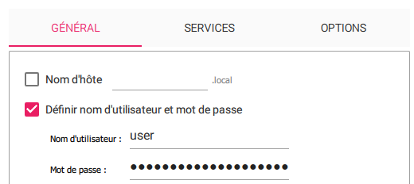
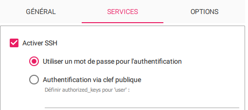
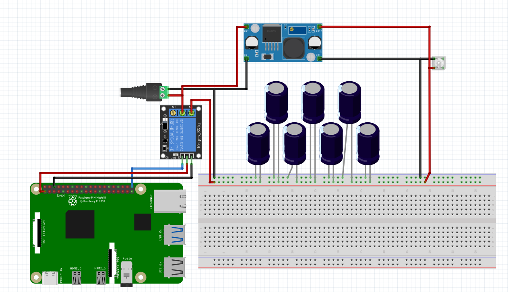

# Battement RPI Relay

OS : Rasbperry Pi OS 64 bit

*Pour l'installer sur une carte micro SD : [Rasbpery Pi Imager](https://www.raspberrypi.com/software/)*

Il faudra créer un utilisateur (user) avec un mdp ainsi que d'autoriser la conneciton en ssh.

<div align = 'center'>





</div>

Depuis la connection SSH, effectuer les commandes suivantes : 

```bash
sudo su
```

```bash
sudo apt-get upgrade -y
```

```bash
sudo apt-get install python3-rpi.gpio -y
```

```bash
cd /home/user/Desktop
```

```bash
mkdir program && cd program
```

```bash
nano main.py
```

Copiez le programme et collez puis faite ``CTRL + X`` puis ``Y``

```bash
nano script.sh
```

Collez ceci :

```bash
#!/bin/bash
cd /home/user/Desktop/program
sudo python3 main.py
```

```bash
chmod +x main.py
```

```bash
chmod +x script.sh
```

```bash
crontab -e
```

Collez a la fin du texte :

```bash
@reboot /home/user/Desktop/program/script.sh
```

## Branchement 

